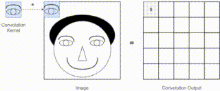

# Speech Emotion Recognition using CNN

<p align="center">
  
</p>

2D CNN trained on log-mel spectrograms and MFCC features for classifying
six emotions from speech. Evaluated on CREMA-D and RAVDESS with a speaker-independent
70/15/15 split. Includes ablation study (SpecAugment, dropout), noise robustness testing
(SNR 20 dB / 5 dB), Grad-CAM interpretability, and transfer learning from CREMA-D to RAVDESS.

## Project structure

| File | Description |
|------|-------------|
| `train.py` | Train the CNN (mel or MFCC, ablation flags, transfer learning) |
| `evaluate.py` | Evaluate saved model: macro F1, noise robustness, confusion matrix |
| `grad_cam.py` | Generate Grad-CAM visualisations (clean or noisy input) |
| `models.py` | EmotionCNN architecture (4 conv blocks, GAP, FC head) |
| `dataloader.py` | Dataset splits and PyTorch DataLoaders for CREMA-D and RAVDESS |
| `feature_extraction.py` | Extract mel spectrograms and MFCCs, save as .npy |
| `augmentation.py` | SpecAugment implementation |
| `visualisation.py` | Training tracker (loss + F1 plots) |

## Setup

1. Clone the repo:
   ```bash
   git clone https://github.com/kassxxv/speech-emotion-recognition-using-cnn.git
   cd speech-emotion-recognition-using-cnn
   ```

2. Download datasets:
   - [CREMA-D](https://github.com/CheyneyComputerScience/CREMA-D) — place `.wav` files in `CREMA-D/`
   - [RAVDESS](https://zenodo.org/record/1188976) — place `.wav` speech files in `RAVDESS/`

3. Install dependencies:
   ```bash
   pip install -r requirements.txt
   ```

## Reproduce paper experiments (seed = 42)

```bash
# 1. Extract features (run once — creates features/ folder)
python feature_extraction.py

# 2. Train all 5 paper configurations
python train.py --feature mel --seed 42                             # Full model (mel)
python train.py --feature mfcc --seed 42                            # MFCC ablation
python train.py --feature mel --no-augment --seed 42                # No SpecAugment
python train.py --feature mel --no-dropout --seed 42                # No Dropout
python train.py --feature mel --dataset ravdess --seed 42           # RAVDESS cross-dataset

# 3. Transfer learning: CREMA-D → RAVDESS
python train.py --feature mel --dataset ravdess --pretrain-from models/mel_best_model.pt --lr 0.0001 --seed 42

# 4. Evaluate (noise robustness + confusion matrix)
python evaluate.py --feature mel
python evaluate.py --feature mfcc
python evaluate.py --feature mel --no-augment
python evaluate.py --feature mel --no-dropout
python evaluate.py --feature mel --dataset ravdess
python evaluate.py --feature mel --dataset ravdess --lr 0.0001 --pretrain-from models/mel_best_model.pt

# 5. Grad-CAM visualisations
python grad_cam.py --feature mel                  # Clean input, all 6 emotions
python grad_cam.py --feature mel --snr 5          # Clean vs SNR-5 dB comparison
```

Open `notebooks/` in Jupyter to explore results interactively.

## Results

| Configuration | Clean F1 | SNR-20 dB | SNR-5 dB |
|---|---|---|---|
| Mel + SpecAugment + Dropout | 61.89% | 55.49% | **48.59%** |
| MFCC + SpecAugment + Dropout | **64.38%** | **57.94%** | 37.18% |
| Mel — no SpecAugment | 62.45% | 51.59% | 32.12% |
| Mel — no Dropout | 62.40% | 55.67% | 43.25% |
| RAVDESS (from scratch) | 38.14% | 20.06% | 10.45% |
| RAVDESS (transfer from CREMA-D) | 44.97% | 41.96% | 30.89% |

All results use macro F1 on the held-out test set, seed = 42.

## Emotions

`angry` · `disgust` · `fear` · `happy` · `neutral` · `sad`
